# API_Final_Project
## Inhoud
- [Uitleg](#uitleg)
- [API](#api)
- [Uitbreiding](#uitbreiding)
- [Links](#links)
- [Postman Screenshots](#Postman-screenshots)
- [API docs Screenshots](#API-docs-screenshots)
- [Auteur](#author)
## Uitleg
 Het thema van mijn api is eigenlijk colruyt, maar .i.p.v. klant gericht te zijn, is het nu beheerder gericht. Dus er zit wel nog wat in van mijn vorig project. Aangezien ik daar ook jobstudent ben en redelijk veel weet over dit onderwerp, was de keuze snel gemaakt.

## API
Mijn api is hier te vinden:  
Link: https://system-service-lucasleys.cloud.okteto.net/  

## Uitbreiding
### 2.1 Pytest testen voor GET Endpoints
#### Testen voor alle users te tonen
- Hier kan u zien hoe de test ineen zit.   
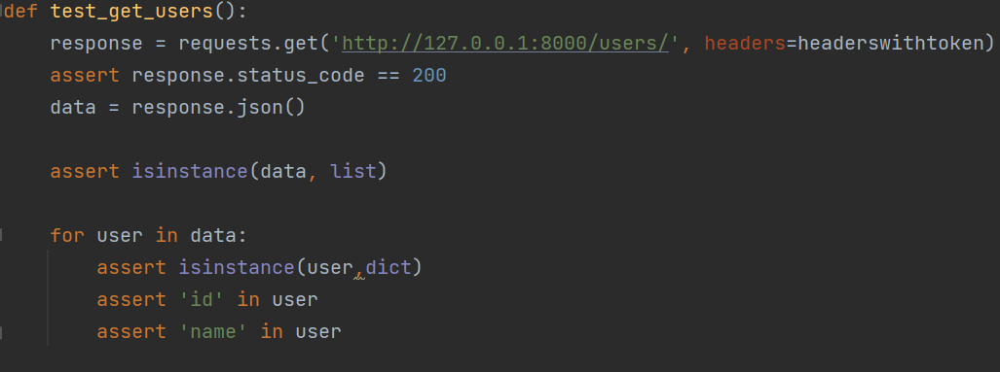
- Resultaat
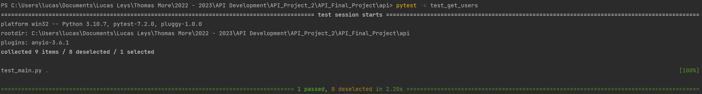
#### Testen voor actieve user te tonen
- Hier kan u zien hoe de test ineen zit.   
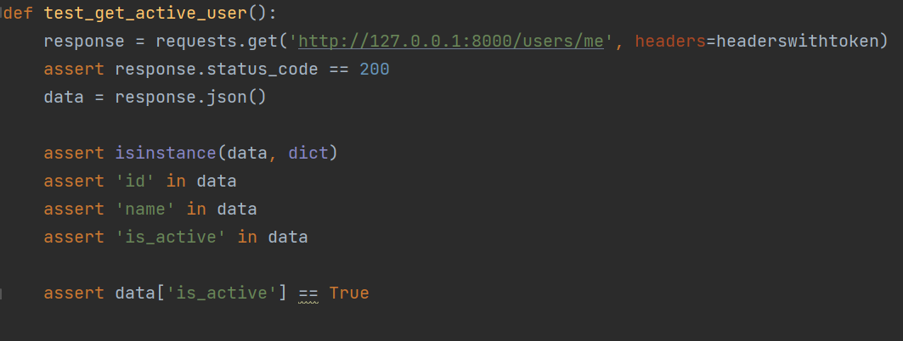
- Resultaat
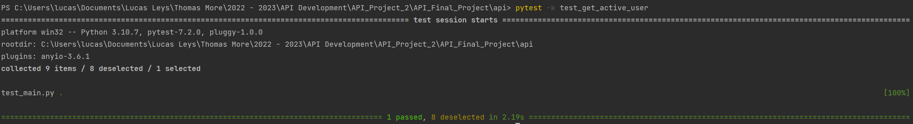
#### Testen voor alle producten te tonen
- Hier kan u zien hoe de test ineen zit.   
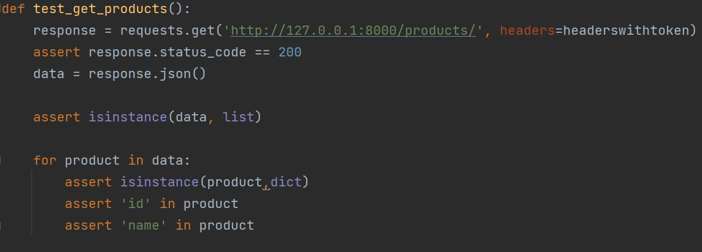
- Resultaat
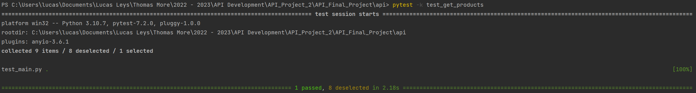
#### Testen voor alle locaties te tonen
- Hier kan u zien hoe de test ineen zit.   

- Resultaat

#### 2.1.1 Test alle niet-GET endpoints
##### POST Testen
###### Testen om een user aan te maken
- Hier kan u zien hoe de test ineen zit.   
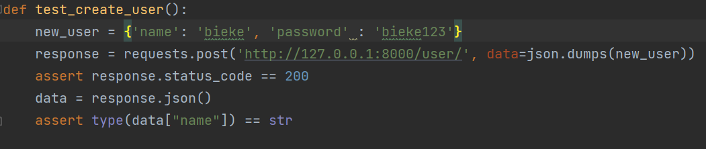
- Resultaat
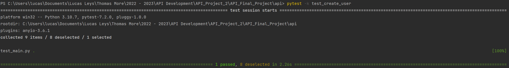
###### Testen om een product aan te maken
- Hier kan u zien hoe de test ineen zit.   
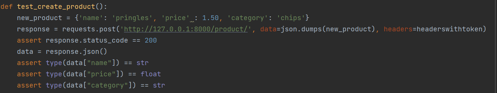
- Resultaat
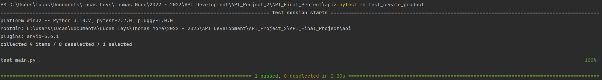
###### Testen om een locatie aan te maken
- Hier kan u zien hoe de test ineen zit.   
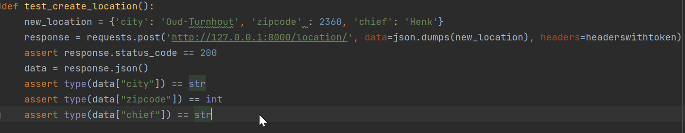
- Resultaat
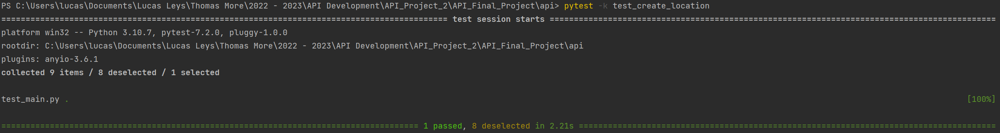
##### PUT Testen
###### Testen om een product te updaten
- Hier kan u zien hoe de test ineen zit.   
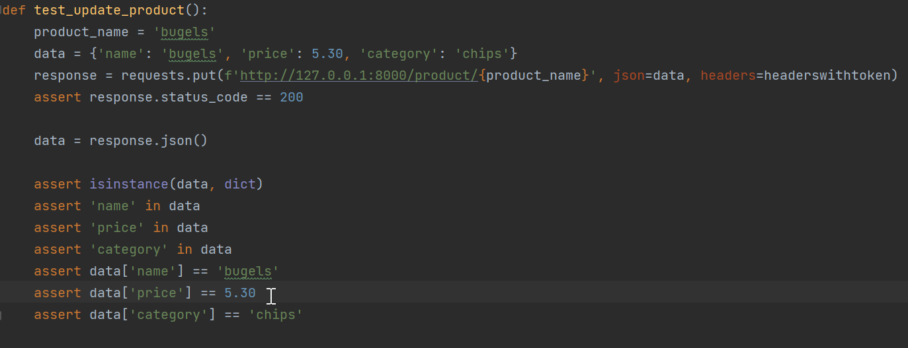
- Resultaat
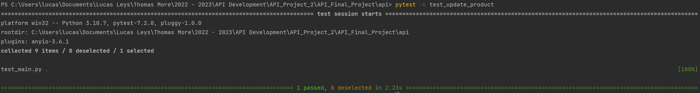
##### DELETE Testen
###### Testen om een product te verwijderen
- Hier kan u zien hoe de test ineen zit.   
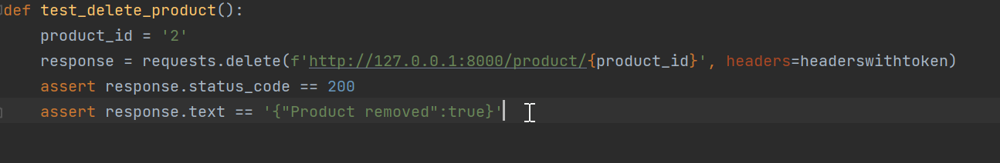
- Resultaat
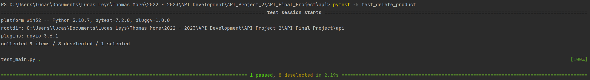

## Links

[Link github repo](https://github.com/lucasleys/API_Final_Project.git)   
[Gehoste API link](https://system-service-lucasleys.cloud.okteto.net/) 

## Postman screenshots

### POST /token
Om een token te kunnen koppelen aan de user zodat die toegang heeft tot de endpoints geef ik password en username mee. 
  

### GET Users
Deze endpoint zorgt ervoor dat u alle gebruikers te zien krijgt. 
 

### GET Current User
Deze endpoint zorgt ervoor dat u de huidige gebruiker te zien krijgt. 
 

### POST User
Doormiddel van deze endpoint kunt u een gebruiker aanmaken door de username en password mee te geven. 

### GET Products
Deze endpoint zorgt ervoor dat u alle producten te zien krijgt. 
 

### POST Product
Doormiddel van deze endpoint kunt u een product aanmaken door de naam, prijs en categorie mee te geven. 
 

### PUT Product
Doormiddel van deze endpoint kunt u een bestaand product aanpassen door de naam in de path op te geven en dan de gegevens die je wilt aanpassen meegeven. 

### DELETE Product
Doormiddel van deze endpoint kunt u een bestaand product verwijderen door de product_id mee te geven. 

### GET Locations
Deze endpoint zorgt ervoor dat u alle locaties te zien krijgt.  

### POST Location
Doormiddel van deze endpoint kunt u een locatie aanmaken door de stad, postcode en gerant/chef mee te geven. 

## API docs screenshots

## Author
Lucas Leys 
[email](mailto:r0881339@student.thomasmore.be)  