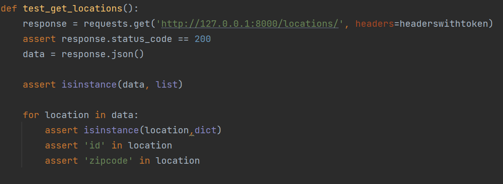

# API_Final_Project
## Inhoud
- [Uitleg](#uitleg)
- [API](#api)
- [Uitbreiding](#uitbreiding)
- [Links](#links)
- [Postman Screenshots](#Postman-screenshots)
- [API docs Screenshots](#API-docs-screenshots)
- [Author](#author)
## Uitleg
 Het thema van mijn api is eigenlijk colruyt, maar .i.p.v. klant gericht te zijn, is het nu beheerder gericht. Dus er zit wel nog wat in van mijn vorig project. Aangezien ik daar ook jobstudent ben en redelijk veel weet over dit onderwerp, was de keuze snel gemaakt.

## API
Mijn api is hier te vinden:  
Link: https://system-service-lucasleys.cloud.okteto.net/  

## Uitbreiding
### 2.1 Pytest testen voor GET Endpoints
#### Testen voor alle users te tonen
- Hier kan u zien hoe de test ineen zit.   

- Resultaat

#### Testen voor actieve user te tonen
- Hier kan u zien hoe de test ineen zit.   

- Resultaat

#### Testen voor alle producten te tonen
- Hier kan u zien hoe de test ineen zit.   

- Resultaat

#### Testen voor alle locaties te tonen
- Hier kan u zien hoe de test ineen zit.   

- Resultaat

#### 2.1.1 Test alle niet-GET endpoints
##### POST Testen
###### Testen om een user aan te maken
- Hier kan u zien hoe de test ineen zit.   

- Resultaat

###### Testen om een product aan te maken
- Hier kan u zien hoe de test ineen zit.   

- Resultaat

###### Testen om een locatie aan te maken
- Hier kan u zien hoe de test ineen zit.   

- Resultaat

##### PUT Testen
###### Testen om een product te updaten
- Hier kan u zien hoe de test ineen zit.   

- Resultaat

##### DELETE Testen
###### Testen om een product te verwijderen
- Hier kan u zien hoe de test ineen zit.   

- Resultaat

## Links

[Link github repo](https://github.com/lucasleys/API_Final_Project.git)   
[Gehoste API link](https://system-service-lucasleys.cloud.okteto.net/)  